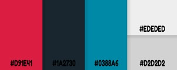

<h1>Tour RP - Aplicativo de Recomendações Culturais</h1>

<section>
<h2>1 - Introdução</h2>

Ribeirão Preto é uma cidade que está em constante desenvolvimento. E com esse desenvolvimento identificamos que há algumas necessidades surgindo na cidade, como a necessidade de encontrar lugares que cada usuário se identifica, para curtir nas horas vagas. Para isso desenvolvemos uma plataforma que indica com precisão os melhores lugares da cidade de acordo com a preferência de cada usuário cadastrado na nossa plataforma, proporcionando a melhor experiência para usuário do nosso aplicativo.

</section>

<section>
<h2>2 - Descrição</h2>

Com a nossa recomendação, visamos atender todos os tipos de público levando para cada um uma experiência única, mostrando lugares e eventos adicionados por clientes, para clientes.  Nossa interface abrange todos os pontos de Ribeirão Preto, desde o mais simples como um food truck local, até lugares mais conhecidos, como um shopping.

A Partir da criação de uma nova conta, nosso aplicativo começará a criar um perfil de recomendação totalmente único, se baseando em informações obtidas inicialmente através de uma tela no qual dará algumas opções para o usuário escolher de acordo com seu gosto.

Quando uma avaliação for feita, isto é, o usuário colocar uma nota em um estabelecimento, tornará tal avaliação pública para todos os interessados em tal lugar ter uma ideia de como é o ambiente, claro que o usuário também possui opção de colocar uma avaliação de modo anônima, porém ainda assim tal avaliação estaria disponível a todos a quem interessar.

Nosso algoritmo de recomendação, visa não somente atender um usuário, mas trazendo opções de atender dois ou mais receber uma recomendação, atendendo ao gosto de todos ao mesmo tempo.

</section>

<section>
<h2>3 - Objetivos propostos</h2>

Atualmente há tantas opções de lugares para visitar em nossa cidade, que muitas dessas opções acabam sendo esquecidas, tornando o consumidor propenso a visitar lugares no qual já está associado como “bom” em sua concepção, nosso objetivo é abrir a visão deste consumidor e trazer diversas outras opções no qual já se adequa a seu gosto particular, afinal, cada um tem o seu próprio.

Visamos trazer essa conexão entre usuário e estabelecimento, tornando a experiência de uma simples noite, como algo novo.

</section>

<section>
<h2>7 - Desenvolvimento da UX/UI</h2>
<h3>7.1 - Interface</h3>

razendo facilidade na usabilidade, ela foi desenvolvida com base em diversos aplicativos que temos hoje no mercado, principalmente a interface do aplicativo “Reddit”, aplicativo de rede social comumente utilizado, visto que nela possui pontos estratégicos que remetem a atenção do usuário e a organização de informações.

Para a criação de toda a interface e podermos apresentá-la, utilizamos uma plataforma gratuita chamada Figma, nela foi possível a criação de telas linkadas para passar o máximo possível da experiência desejada, é possível testar a interface em tempo real agora mesmo, basta utilizar o qr code abaixo:

Nesta versão online é possível verificar peculiaridades únicas de nossa app, na qual apresentar por escrito não seria tão intuitivo como a utilização de fato.

Para a nossa identidade visual, utilizamos programas como Photoshop e Canvas para desenvolvê-las, utilizamos da fonte Fredoka One, no qual apresenta traços de inovação a qual queremos que passe esta ideia em nossa logo, foi utilizada a imagem de um planeta para formar a logo, substituindo a letro “o” de “Tour”, visto que nosso projeto engloba lugares e eventos.

Para especificar, utilizamos identificação do projeto em nossa logo, com o uso de uma frase que apresenta um dos pilares da ideia de nosso aplicativo, que representa que todo o conteúdo disposto em nossa plataforma não há ligações com empresas, mostrando somente a opinião verdadeira de outros usuários.

<h3>7.3 - Paleta de cores</h3>

Visando uma leitura clara do nosso aplicativo, usamos o site coloradobe.com para encontrar uma paleta de cores que acreditamos melhor se encaixar na nossa proposta, algo que remete a simplicidade.

Podemos notar que as cores dominantes no projeto se encontram no aspecto escuro em nossa paleta, tendo a utilização de detalhes a cor clara, mantendo um padrão e trocando somente o tom.

Para diversificar, utilizamos um tom de vermelho em nossa logo que nos permite realizar uma quebra de cor com o restante da interface, gerando um contraste e chamando a atenção para um ponto em específico.

</section>

<section>
<h2>8 - Considerações finais</h2>

O aplicativo traz uma funcionalidade de avaliação e opinião sobre os lugares que já foram visitados, assim trazendo uma experiência mais agradável para outros usuários. Trazendo um algoritmo de recomendação, conseguimos, baseado em suas preferências, lhe mostrar um plano para a sua noite, por exemplo, assim otimizando o seu processo de escolha para uma atividade, seja sozinho ou com amigos.

Com uma fórmula inovadora e nunca antes vista, o nosso app reúne várias funcionalidades como recomendações com base nas suas preferências de eventos e lugares nas quais você nunca saberia se não através do Tour RP. Após a criação da conta, você é apresentado a uma tela em que é possível personalizar a sua experiência, selecionando os seus gostos pessoais.  

E qual a diferença do nosso app com o Google? A formulação de um cronograma que vai desde o café da manhã até a balada da noite. Na aba lugares, lhe será apresentado três guias, será possível escolher entre lugares mais populares, mais indicados para você e lugares para você experimentar. 

Tem um encontro e não sabe onde ir? Compartilhe seu perfil com o crush e a Tour se encarrega de selecionar os melhores lugares e o encontro perfeito para vocês!

Com a Tour conheça os melhores lugares baseado no seu gosto!

</section>

